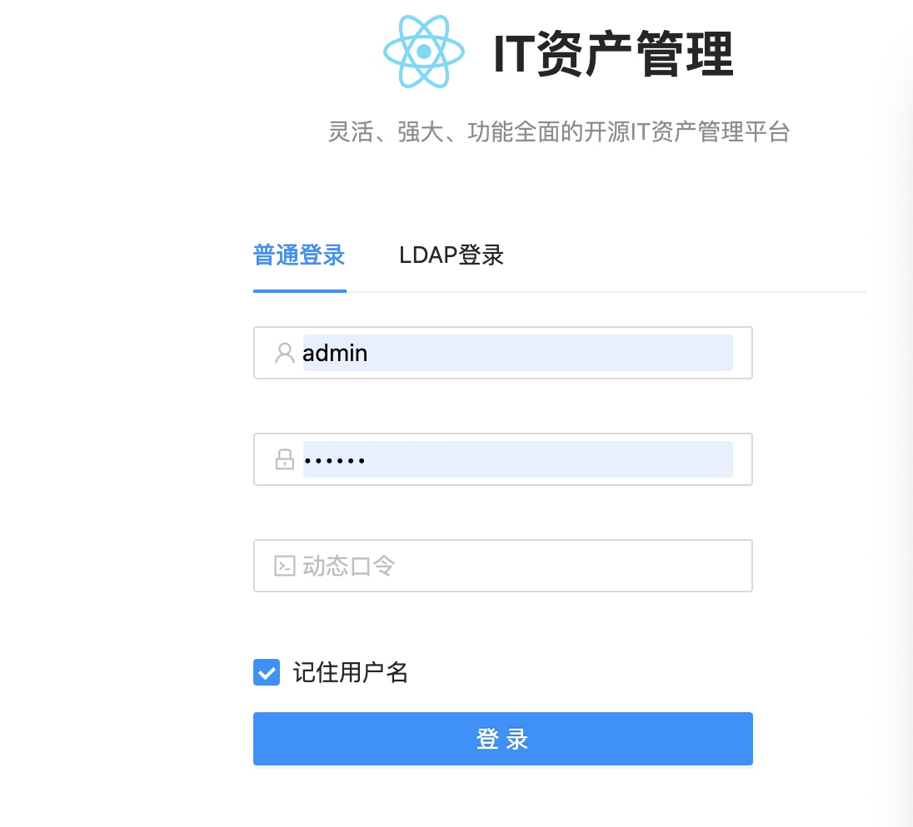

<h1 align="center">IT资产管理</h1>


## 特性

```
这个项目是一个为了方便职场it资产管理， 基于gin封装的后台，基于react提供的前端。

（项目利用业务时间写完了，还没有用，公司没了。 项目没有经过系统测试，可能存在小的bug，但主要功能已经测试过了，可放心使用，如遇到bug或者需求可以提出来，我会尽快完善。 ）
```
## Change Log
```
v1.1
第一个版本
```
## 安装
### 前端

```
// 参考链接
https://ant.design/docs/react/introduce-cn

// 安装依赖
npm install

// 开发环境
umi dev
```
### 前端线上部署 
```
1）在项目前端的根目录下，执行
umi build

2) 把 dist 目录同步到线上机器需要部署的位置

3） 使用Nginx做部署， 配置文件如下。
做了来源访问限制。
```
```
# cat /etc/nginx/conf.d/omp.zhien88.com.conf
map $http_upgrade $connection_upgrade {
    default upgrade;
    '' close;
}


upstream omp {
    server 127.0.0.1:1339;
}

server {
    server_name omp.zhien88.com;
    listen 3000;
    gzip on;
    gzip_min_length 1k;
    gzip_comp_level 9;
    gzip_types text/plain application/javascript application/x-javascript text/css application/xml text/javascript application/x-httpd-php image/jpeg image/gif image/png;
    gzip_vary on;
    gzip_disable "MSIE [1-6]\.";
    #include /etc/nginx/ssl-params.conf;

    root /data/omp/web/dist;

    location @fallback {
        rewrite .* /index.html break;
    }

    location / {
        allow 10.0.0.0/8;
        allow 127.0.0.1;
        deny all;
        try_files $uri @fallback;
        autoindex on;
    }

    location /api/ {
        allow 10.0.0.0/8;
        allow 127.0.0.1;
        deny all;
        proxy_pass http://omp;
        proxy_read_timeout 300s;
        proxy_send_timeout 300s;

        proxy_set_header Host $host;
        proxy_set_header X-Real-IP $remote_addr;
        proxy_set_header X-Forwarded-For $proxy_add_x_forwarded_for;

        proxy_http_version 1.1;
        proxy_set_header Upgrade $http_upgrade;
        proxy_set_header Connection $connection_upgrade;
        client_max_body_size    100m;
    }
}
```
### 后端

```
1, 需要手动创建表结构
请预先创建好编码为utf8mb4的数据库，如 cmdb-go
导入基本表结构，文件在 files/cmdb-go.sql


2, 运行后台项目
go build main.go
```

### 后端线上部署
```
1) 打包成 linux 平台的二进制包 
CGO_ENABLED=0 GOOS=linux GOARCH=amd64 go build  main.go


2）copy 依赖目录和文件到部署机器的相应目录
[root@monitor ~]# cd /data/cmdb/api
[root@monitor api]# ll
总用量 44832
-rwxr-xr-x 1  501 games 45879616 6月   6 23:15 main
-rw-rw-r--@ 1 angus  staff   680B  4 25 15:52 app.yaml
drwxr-xr-x  3 angus  staff    96B  4 25 15:33 files
drwxrwxr-x@ 3 angus  staff    96B  4 25 15:20 manager
drwxrwxr-x@ 4 angus  staff   128B 11  4 09:57 runtime


3）systemd  启动配置

[root@monitor api]# cat /etc/systemd/system/ompapi.service
[Unit]
Description=ompapi
After=network.target

[Service]
Type=simple
WorkingDirectory=/data/cmdb/api
ExecStart=/data/cmdb/api/main
RestartSec=10s
Restart=on-failure
UMask=0007

[Install]
WantedBy=multi-user.target

4) 启动和开机自启动
略
```

## 预览





